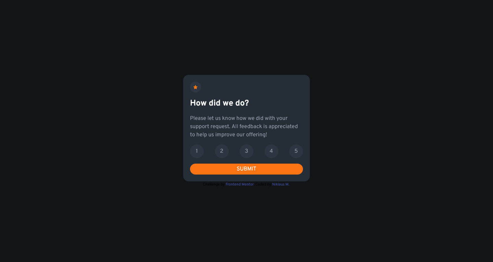

# Frontend Mentor - Interactive rating component solution

This is a solution to the [Interactive rating component challenge on Frontend Mentor](https://www.frontendmentor.io/challenges/interactive-rating-component-koxpeBUmI). Frontend Mentor challenges help you improve your coding skills by building realistic projects. s

## Table of contents

- [Overview](#overview)
  - [Screenshot](#screenshot)
  - [Links](#links)
- [My process](#my-process)
  - [Built with](#built-with)
  - [What I learned](#what-i-learned)
  - [Useful resources](#useful-resources)
- [Author](#author)

## Overview

### Screenshot

### Links

- Solution URL: [Solution](https://github.com/Dhruv-mak/interactive-rating-component)
- Live Site URL: [Live Site](https://dhruv-mak.github.io/interactive-rating-component/)

## My process

### Built with

- Semantic HTML5 markup
- CSS custom properties
- Flexbox
- Mobile-first workflow
- Vanilla javascript
- javascript DOM manipulation
- CSS animation

### What I learned

- HTML Structure: I got familiar with the structure of an HTML document, including the `<html>`, `<head>`, and `<body>` elements.

- HTML Elements: I explored various HTML elements such as `<meta>`, `<link>`, `<title>`, `<section>`, `
`, `<h1>`, `
`, `<ul>`, `<li>`, `<button>`, and ``. I understood how each element plays a specific role in organizing the webpage's structure and displaying content.

- CSS Classes: I discovered the power of CSS classes by using the class attribute to apply styles to specific elements or groups of elements. By applying classes like bg-very_dark_blue, h-screen, flex, items-center, and justify-center, I was able to define the appearance and layout of different components.

- External Resources: I learned how to include external resources in my webpage, such as stylesheets using the `<link>` element and JavaScript files using the `<script>` element.

- Responsive Design: I observed the use of the viewport meta tag and responsive CSS classes (bg-very_dark_blue, h-screen, flex, items-center, etc.). This indicated that the webpage was designed to adapt to different screen sizes and provide a responsive user experience.

- Interactive Components: I got hands-on experience with an interactive rating component where users can select a rating and submit it. This component involved the use of buttons with different styles and event handlers to capture user input and trigger actions.

- Third-Party Libraries: I utilized the Font Awesome library by including it from a CDN. This allowed me to leverage pre-designed icons to enhance the visual appearance of my webpage.

- Collaboration and Attribution: I appreciated the importance of acknowledging collaboration and giving credit. I noticed that the code included an attribution section, giving credit to the challenge provider (Frontend Mentor) and the developer who coded the project (Niklaus M.).

Overall, this small project provided me with practical insights into building a simple interactive component within a webpage. I got to work with HTML, CSS, and a bit of JavaScript. It emphasized the significance of proper structure, styling, and the use of external resources to create engaging and visually appealing webpages.

### Useful resources

- [Tailwind css Documentation](https://tailwindcss.com/docs/installation) - I'm just starting out and this helped me to quickly style the html elements.
- [W3schools](https://www.w3schools.com/) - This is an amazing article which helped me finally understand flexbox. I'd recommend it to anyone still learning this concept.

## Author

- Website - [Niklaus M](https://www.your-site.com)
- Frontend Mentor - [@Dhruv-mak](https://www.frontendmentor.io/profile/Dhruv-mak)